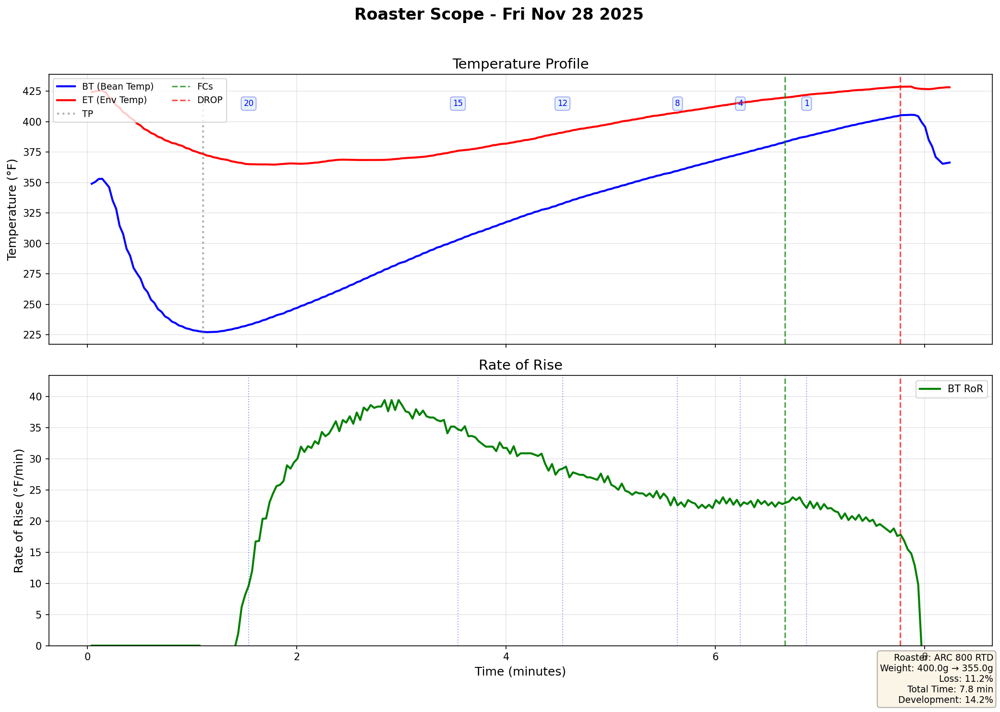

| Roast | Date | Time | Dev % | Profile |
|-------|------|------|-------|----------|
| #31 | Fri Dec 5 2025 | 8.0 min | 14.2% |  |
| #30 | Sat Nov 29 2025 | 9.9 min | 13.1% |  |
| #28 | Fri Nov 28 2025 | 10.1 min | 11.3% |  |
| #27 | Fri Nov 28 2025 | 9.7 min | 18.2% |  |
| #26 | Fri Nov 28 2025 | 11.0 min | 11.9% |  |
| #25 | Fri Nov 28 2025 | 10.0 min | 15.0% |  |
| #24 | Fri Nov 28 2025 | 10.1 min | 14.5% |  |
| #23 | Fri Nov 28 2025 | 7.8 min | 14.2% |  |
